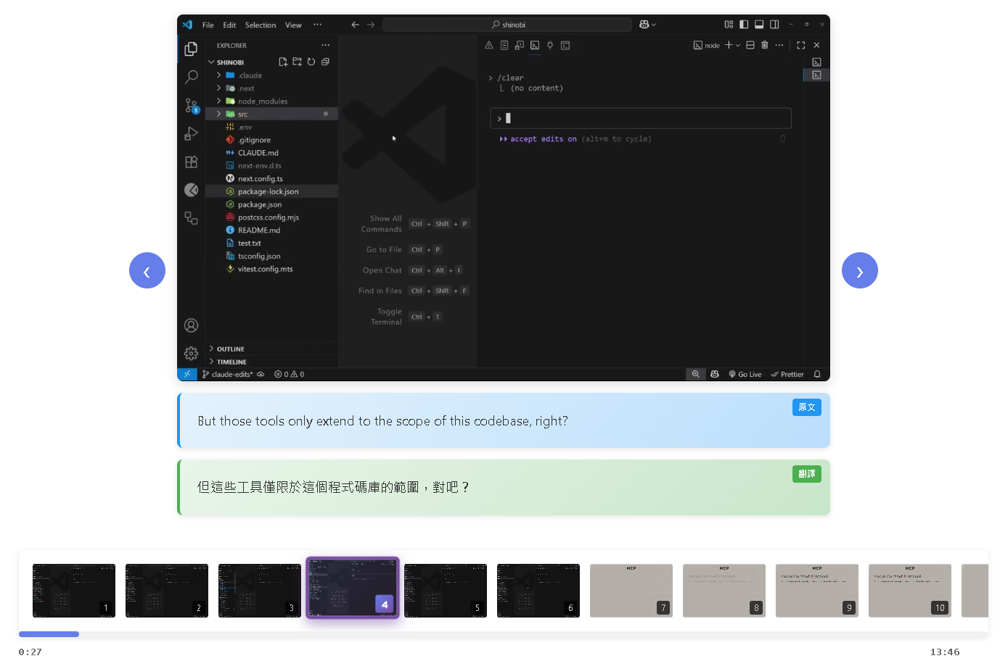
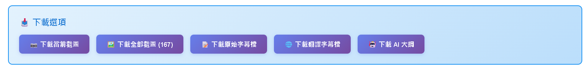
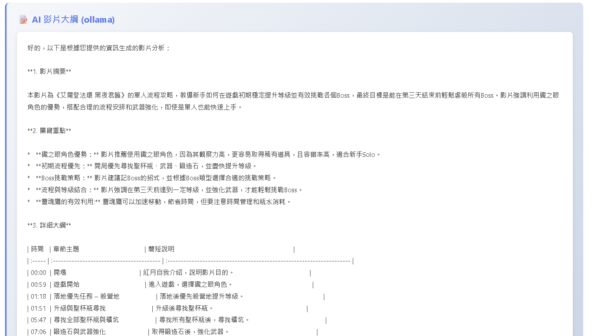
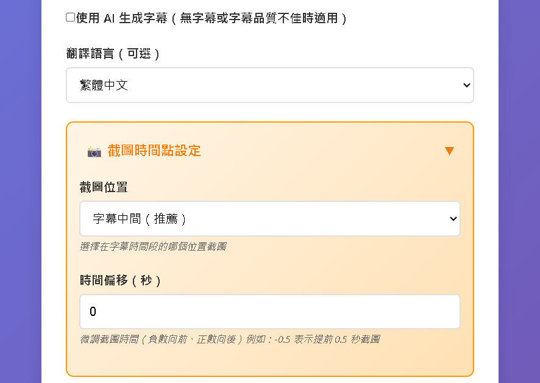
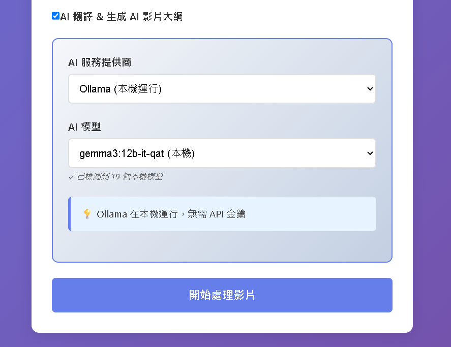

# YouTube2Slides

> 將 YouTube 影片轉換為靜態閱讀版本（投影片）的 Web 應用程式。

- 一鍵輸入 YouTube 連結，下載影片與字幕（手動或自動產生）。
- 智慧斷句與字幕最佳化（支援中/日/韓等 CJK 字元）。
- 擷取關鍵畫面，生成「逐頁幻燈片」觀看流程。
- 可選擇翻譯與 AI 產生影片大綱（支援 OpenAI / Claude / Gemini / 本機 Ollama）。

## 功能特色

- ✅ 將 YouTube 影片轉換為好閱讀的投影片



- ✅ 一鍵下載各種檔案



- ✅ AI 產生影片大綱




| 輸入 YouTube 連結自動處理 | 支援多國語言翻譯 | 可使用多種 AI 模型 |
|-------|-------|-------|
|  |  |  |


## 🚀 快速啟動說明


### 🪟 Windows 用戶


#### 🔧 前置準備（必須）
1. **安裝 Python 3.9+**
   - [下載連結](https://www.python.org/downloads/)
   - 安裝時請勾選 **「Add Python to PATH」**


2. **安裝 Node.js 16+**
   - [下載連結](https://nodejs.org/)
   - 建議下載 **LTS（長期支援）版本**


3. **安裝 uv（Python 套件管理工具）**
   - 開啟 PowerShell 並執行以下指令：
   ```powershell
   powershell -ExecutionPolicy ByPass -c "irm https://astral.sh/uv/install.ps1 | iex"
   ```
   - 完成後重新開啟終端機，輸入 `uv --version` 驗證安裝成功


4. **安裝 ffmpeg（必須）**
   ffmpeg 是影片處理核心工具，必須安裝才能正常使用。

   *方法 1：使用 Chocolatey（推薦）*
   - 以系統管理員身份執行「PowerShell」，並一次貼上整段以下指令：
   ```powershell
   Set-ExecutionPolicy Bypass -Scope Process -Force; `
   [System.Net.ServicePointManager]::SecurityProtocol = [System.Net.ServicePointManager]::SecurityProtocol -bor 3072; `
   iex ((New-Object System.Net.WebClient).DownloadString('https://community.chocolatey.org/install.ps1'))
   ```
   - 完成後輸入 `choco -v` 驗證安裝成功
   - 透過 choco 安裝 ffmpeg：
   ```powershell
   choco install ffmpeg
   ```
   - 完成後輸入 `ffmpeg -version` 驗證安裝成功
   - ⚠️ 請重新開機

   *方法 2：手動安裝*
   - [下載 ffmpeg](https://www.gyan.dev/ffmpeg/builds/) → 選擇 **ffmpeg-release-essentials.zip**
   - 解壓縮到任意位置（例：`C:\ffmpeg`）
   - 將 `bin` 路徑加入 **系統環境變數 PATH**
   - 重新開啟命令提示字元並輸入 `ffmpeg -version` 驗證
   - ⚠️ 請重新開機


---


#### ▶️ 快速啟動步驟


1️⃣ `git clone https://github.com/FlagTech/YouTube2Slides` 或直接下載、解壓縮專案

2️⃣ 進入 `YouTube2Slides` 資料夾

3️⃣ 雙擊執行 **`setup_and_start.bat`**


此腳本會自動完成：
- ✅ 檢查 Python / Node.js / ffmpeg / uv
- ✅ 建立 Python 虛擬環境 & 安裝所需依賴
- ✅ 啟動前後端服務器（port 8000；port 3000）
- ✅ 自動開啟瀏覽器

**注意事項：**
- 缺少必要環境會提示錯誤並提供安裝指引
- 首次執行會需要較長時間安裝依賴
- 程式會在 cmd 視窗中運行，關閉即可停止

---

### 🍏 macOS / Linux 用戶

#### 🔧 前置準備
1. **安裝 Python 3.9+、Node.js 16+、ffmpeg**
   - macOS: `brew install python node ffmpeg`
   - Ubuntu/Debian: `sudo apt install python3 nodejs npm ffmpeg`

2. **安裝 uv**
   ```bash
   curl -LsSf https://astral.sh/uv/install.sh | sh
   ```

#### ▶️ 啟動步驟
進入專案根目錄後執行：
```bash
python3 setup_and_start.py
```

## API 端點

### 影片資訊
```http
POST /api/video/info
Content-Type: application/json

{
  "url": "https://www.youtube.com/watch?v=VIDEO_ID"
}
```

### 處理影片
```http
POST /api/video/process
Content-Type: application/json

{
  "url": "https://www.youtube.com/watch?v=VIDEO_ID",
  "quality": "720",
  "subtitle_languages": ["zh-TW", "en"],
  "translate_to": "zh-TW",
  "frame_threshold": 2.0
}
```

### 查詢任務狀態
```http
GET /api/jobs/{job_id}
```

### 翻譯文字
```http
POST /api/translate
Content-Type: application/json

{
  "text": "Hello world",
  "source_lang": "en",
  "target_lang": "zh-TW"
}
```

### 獲取支援語言
```http
GET /api/languages
```

## 專案結構

```
YouTube2Slides/
├── backend/
│   ├── app.py                      # FastAPI 主應用
│   ├── pyproject.toml              # uv 專案設定檔
│   ├── services/
│   │   ├── youtube.py              # YouTube 影片下載 (yt-dlp)
│   │   ├── subtitle.py             # 字幕解析、合併、時間軸處理
│   │   ├── subtitle_optimizer.py   # 字幕斷行與格式優化
│   │   ├── frame_extractor.py      # 影格擷取 (ffmpeg)
│   │   ├── translator.py           # Google 翻譯服務
│   │   ├── ai_translator.py        # AI 翻譯 (OpenAI/Claude/Gemini/Ollama)
│   │   ├── ai_outline.py           # AI 大綱生成服務
│   │   └── audio_transcription.py  # Whisper 音訊轉字幕
│   ├── models/
│   │   └── schemas.py              # Pydantic 資料模型
│   └── utils/                      # 工具函數
├── frontend/
│   ├── public/
│   │   └── index.html
│   ├── src/
│   │   ├── App.js                  # 主應用組件
│   │   ├── App.css                 # 全域樣式
│   │   ├── components/
│   │   │   ├── VideoInput.js       # 影片輸入表單與 AI 設定
│   │   │   ├── ProcessingStatus.js # 處理進度顯示
│   │   │   ├── SlideViewer.js      # 投影片檢視器（含鍵盤導航）
│   │   │   └── Sidebar.js          # 歷史記錄與資料夾管理
│   │   ├── api/
│   │   │   └── api.js              # API 客戶端
│   │   └── utils/
│   │       ├── historyManager.js   # localStorage 歷史記錄管理
│   │       └── settingsManager.js  # 使用者設定管理
│   └── package.json
├── storage/                        # 後端儲存目錄
│   └── {job_id}/
│       ├── video.mp4               # 下載的影片
│       ├── original_subtitle.srt   # 原始字幕
│       ├── translated_subtitle.srt # 翻譯後字幕
│       ├── ai_outline.txt          # AI 生成的大綱
│       └── frames/                 # 截取的影格
│           ├── frame_0001.jpg
│           ├── frame_0002.jpg
│           └── ...
├── setup_and_start.bat             # Windows 自動啟動腳本
├── setup_and_start.py              # macOS/Linux 自動啟動腳本
├── CLAUDE.md                       # Claude Code 專案說明
└── README.md
```

## 疑難排解

### ffmpeg 未找到
```
Error: ffmpeg not found
```
**解決方案**:
1. 安裝 ffmpeg（參考上方安裝說明）
2. 確保 ffmpeg 已加入系統 PATH
3. 重新開啟命令提示字元或重啟電腦
4. 執行 `ffmpeg -version` 驗證安裝成功

### 字幕不可用
```
Error: No subtitles available
```
**解決方案**:
- 使用 OpenAI Whisper 模型辨識音頻 (需申請 API Key)

### CORS 錯誤
```
Access to fetch has been blocked by CORS policy
```
**解決方案**: 確認後端 CORS 設定正確，或在生產環境中設定具體的 origin

## 未來改進

- [ ] OCR 文字辨識（從投影片提取額外文字）
- [ ] AI 自動摘要（整合 OpenAI/Claude API）
- [ ] 場景變化偵測（更智能的截圖時機）
- [ ] 匯出 PDF/PPT 格式
- [ ] 批次處理多個影片
- [ ] 使用者帳號系統與分享功能
- [ ] Redis 快取與 Celery 任務佇列
- [ ] Docker 容器化部署

## 授權

MIT License

## 貢獻
